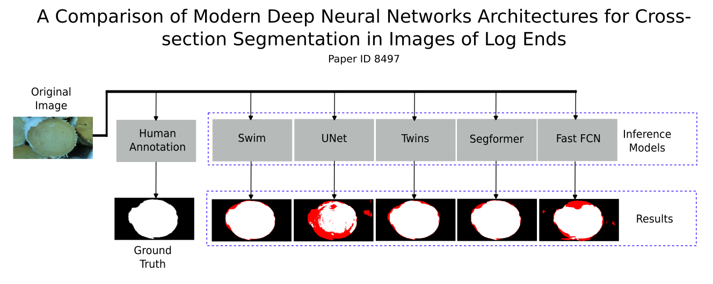

This is the repository of the article entitled

# A Comparison of Modern Deep Neural Networks Architectures for Cross-section Segmentation in Images of Log Ends

## Abstract

The semantic segmentation of log faces constitutes the initial step towards subsequent quality analyses of timber, such as quantifying properties like mechanical strength, durability, and the aesthetic attributes of growth rings. In the literature, works based on both classical and machine learning approaches for this purpose can be found. However, more recent architectures and techniques, such as Vits or even the latest CNNs, have not yet been thoroughly evaluated. This study presents a comparison of modern deep neural network architectures for cross-section segmentation in images of log ends. The results obtained indicate that the networks using the ViTs considered in this work outperformed those previously evaluated in terms of both accuracy and processing time.



## Deploy

1 - Install [MM Segmentation](https://github.com/open-mmlab/mmsegmentation). This work was elaborated using MM Segmentation version 0.30.0.
2 - Clone this repository\ ```shell git clone https://github.com/NackFelipe/ModernWoodSegmentation.git```
3 - Update the file cityscapes.py at your MM Segmentation installation folder (.../mmsegmentation/mmseg/datasets/cityscapes.py)\
4 - Run the script main.py
```shell
python main.py ${CONFIG_FILE} ${CHECKPOINT_FILE} [optional arguments]
```

## Usage

Download your desired checkpoint file and the dataset. Execute step 4 of the Deploy section with them. Check the links below to download all files:

Original datasets:

[ane.zip](https://drive.google.com/file/d/1u6o0Z-hPawR-3qsUISxFtP5-yBsxWjS8/view?usp=sharing)\
[huawei.zip](https://drive.google.com/file/d/1cQSk5or9DsBxFqpRh0GeYDqEVEQugfUh/view?usp=sharing)\
[lumix.zip](https://drive.google.com/file/d/1HfvphBvTXQfrdDF_Wu5yX-CY-xrl5wfA/view?usp=sharing)\
[sbg_TS3.zip](https://drive.google.com/file/d/1Vz8zg2iNpZATCbC9OP5rec1PT8xoID36/view?usp=sharing)\
[sbg_TS12.zip](https://drive.google.com/file/d/1H60tf0W6qpV6m9LkNGK9vIRNHJHx7djq/view?usp=sharing)

Prepared dataset:

[ModernWoodSegmentation.zip](https://drive.google.com/file/d/1PlGnudK6ze0bXriB7os7PfVRClzIcxID/view?usp=sharing)

### U-Net

| Dataset        | Config File  | Checkpoint  |
|----------------|-----------|-------------|
| All            |unet_all.py|[unet_all.pth](https://drive.google.com/file/d/1NV8_Pejjl3L4VGz6WMFp5dry8PWJc27I/view?usp=sharing)|
| ane            |unet_ane.py|[unet_ane.pth](https://drive.google.com/file/d/1KssTi1LbuK60-kS2krJc2JX5zcl0sRue/view?usp=sharing)|
| huawei         |unet_huawei.py|[unet_huawei.pth](https://drive.google.com/file/d/1NjuQcZaPq1Ipb_p5ijvWIzcUnQYnl_cK/view?usp=sharing)|
| lumix          |unet_lumix.py|[unet_lumix.pth](https://drive.google.com/file/d/1ozJS0GfHyAkSU9xphGtcL-93PocEMULO/view?usp=sharing)|
| sbg_TS3        |unet_sbgts3.py|[unet_sbgts3.pth](https://drive.google.com/file/d/1yoSSUbAXOjTkmGtNLb4pZG5YWMu3gE57/view?usp=sharing)|
| sbg_TS12       |unet_sbgts12.py|[unet_sbgts12.pth](https://drive.google.com/file/d/1_Hk4F0Zi0Dt2ryaLsRL4QBM9Xz3c67DR/view?usp=sharing)|

### Fast FCN

| Dataset        | Config File  | Checkpoint  |
|----------------|-----------|-------------|
| All            |fastfcn_all.py|[fastfcn_all.pth](https://drive.google.com/file/d/1YDPEImU7Sy_vPtAU9w8QL9NEsroiGq6r/view?usp=sharing)|
| ane            |fastfcn_ane.py|[fastfcn_ane.pth](https://drive.google.com/file/d/19DGB8FnvaYdwH-nw7ENqODU-vHiOTg4l/view?usp=sharing)|
| huawei         |fastfcn_huawei.py|[fastfcn_huawei.pth](https://drive.google.com/file/d/1Oh2E9i0vWHnVIDwjIJTeVw5g2nrkRvn6/view?usp=sharing)|
| lumix          |fastfcn_lumix.py|[fastfcn_lumix.pth](https://drive.google.com/file/d/1YEtv5WxInNey3x0TK2zDWkd3l2PsFZhk/view?usp=sharing)|
| sbg_TS3        |fastfcn_sbgts3.py|[fastfcn_sbgts3.pth](https://drive.google.com/file/d/1l_YU91jb0ses16eWji-iTQCdH6JLai3R/view?usp=sharing)|
| sbg_TS12       |fastfcn_sbgts12.py|[fastfcn_sbgts12.pth](https://drive.google.com/file/d/1P2J7slROwP5Q03ZKAiJjDGuqQzQe0ytl/view?usp=sharing)|

### Segformer

| Dataset        | Config File  | Checkpoint  |
|----------------|-----------|-------------|
| All            |segformer_all.py|[segformer_all.pth](https://drive.google.com/file/d/1OgP7zbdJSvAVkx-txB_vbxC1cCbMCY3s/view?usp=sharing)|
| ane            |segformer_ane.py|[segformer_ane.pth](https://drive.google.com/file/d/17FhnYYRlWSy36VGKvDgaf76ZDroTJcie/view?usp=sharing)|
| huawei         |segformer_huawei.py|[segformer_huawei.pth](https://drive.google.com/file/d/1lwZL2PzZeatGoT7xvYC6l9LeEuXUgA-9/view?usp=sharing)|
| lumix          |segformer_lumix.py|[segformer_lumix.pth](https://drive.google.com/file/d/1aLmmNQ4TtKHA7fqkvoPkgUzsAtQeZpz9/view?usp=sharing)|
| sbg_TS3        |segformer_sbgts3.py|[segformer_sbgts3.pth](https://drive.google.com/file/d/1v_SmTmzDXsUmSMTGfv9MlVfC_sPMVLmm/view?usp=sharing)|
| sbg_TS12       |segformer_sbgts12.py|[segformer_sbgts12.pth](https://drive.google.com/file/d/13a9_qTWpK6wNRcStMpsU8YBKjVhmyOPD/view?usp=sharing)|

### Swin

| Dataset        | Config File  | Checkpoint  |
|----------------|-----------|-------------|
| All            |swin_all.py|[swin_all.pth](https://drive.google.com/file/d/1BAFbl9N5OgRtT4IqbkIwnx0ZesijV57E/view?usp=sharing)|
| ane            |swin_ane.py|[swin_ane.pth](https://drive.google.com/file/d/1QgRCs8bXxFX8R_-j96joVZogG57bvEsq/view?usp=sharing)|
| huawei         |swin_huawei.py|[swin_huawei.pth](https://drive.google.com/file/d/1YRDiWkWuQauyMpIjOJIio1dtZQBvtpPg/view?usp=sharing)|
| lumix          |swin_lumix.py|[swin_lumix.pth](https://drive.google.com/file/d/19rgM4SBZldEPcm0jxfu1sSZprr2x_J_e/view?usp=sharing)|
| sbg_TS3        |swin_sbgts3.py|[swin_sbgts3.pth](https://drive.google.com/file/d/1EFhnj14LINnecECJq7cP2dYEIe2A9EVd/view?usp=sharing)|
| sbg_TS12       |swin_sbgts12.py|[swin_sbgts12.pth](https://drive.google.com/file/d/1n48sAUIXiZNhwoycxkl7EaSJiM6GDvo1/view?usp=sharing)|

### Twins

| Dataset        | Config File  | Checkpoint  |
|----------------|-----------|-------------|
| All            |twins_all.py|[twins_all.pth](https://drive.google.com/file/d/1YMRatTg8Zw_CE7LSS5TfmAP-1awQx2Ox/view?usp=sharing)|
| ane            |twins_ane.py|[twins_ane.pth](https://drive.google.com/file/d/120-algo6afLBDL4S4UXWHTgSIwSmNzJE/view?usp=sharing)|
| huawei         |twins_huawei.py|[twins_huawei.pth](https://drive.google.com/file/d/14jb5dEwyG4xPFCXqB8RQUxaR-sujd0bZ/view?usp=sharing)|
| lumix          |twinslumix.py|[twins_lumix.pth](https://drive.google.com/file/d/1tM5RWL8U3xR4TvkPPnhubmi-_X-Twtfo/view?usp=sharing)|
| sbg_TS3        |twins_sbgts3.py|[twins_sbgts3.pth](https://drive.google.com/file/d/1IaSpOS-DUzLFOCkDyhmZgSLTLxRJGXxs/view?usp=sharing)|
| sbg_TS12       |twins_sbgts12.py|[twins_sbgts12.pth](https://drive.google.com/file/d/1x1QC3e1_PmMzFwYRwl6E11Ywmhqo9kNs/view?usp=sharing)|

